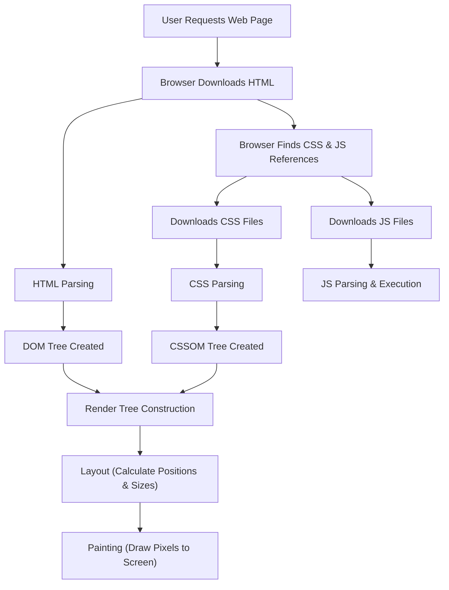

# Lesson

## 📝 Lesson 1

1. Created a GitHub Pages repository with a README and showed it live.
2. Cloned the repository (set up with SSH).
3. Deleted the README and replaced it with `index.html` (used Emmet abbreviation).
4. Ran `git add`, `commit`, and `push`, and explained what was happening. Saw the index page.
5. Explained that whenever you pushed, this was reflected on the website.
6. Explained that we could learn a lot about how the front end of a website works from iterating on this.
7. Launched in Chrome Developer Tools and show the DOM.
   

## 📝 Lesson 2
1. Went through any questions from last time or optional challenges
2. Installed and set up liveshare.
3. In VS Code, opened `index.html`, discussed Emmet abbreviations more, created a nav bar using Emmet (`nav>a*4`) as well as sections: About, Skills, Projects, Contact. Gave each a fixed height of 500px to show jumping to each section when clicking the nav bar.
4.   Went back to `index.html` and installed the Prettier extension, showed the keyboard shortcut to format.
5.  Discussed flex styling , shwowing example html file. Made the nav bar nicer by styling with flex, used the opportunity to create `style.css` and talked about how CSS is used.

## Lesson 3
TODO: think about how this lesson could be structured and what prep student can do, cheat sheet beforehand ie basic index + js example I could send with some optional practise before hand and some basic styling imported that student could then improve, ask to use flex box, ask to do some things woth javascript for example.

1. Showed how to add a script at the bottom of the body, used `alert` and `console.log()`, discussed how the console is useful for seeing errors, and tried causing an error to see it.
2.  Moved JavaScript into its own file and imported it.
3.  Created a button called Dark Mode.
4.  On click, made an alert—did this without `defer` and explained how JS was looking for the element before it loaded, and that was why the `defer` keyword was needed.
5.  In Developer Tools, showed the body element. Showed how to access the body element in the console using JS, how to access `classList`, and how to add and remove elements.
6.  Explained that we would now do this in our code. Switched back to the code and added the class value `dark-mode` to the body element, showed how to add/remove the value using JavaScript, and inspected the DOM

## Flow Diagrams

**Figure 2:** Flow diagram showing how a browser renders a webpage

## 🤔 Skill building challenges that could be attempted before next session

1. You could add side margins to the document [margin docs](https://developer.mozilla.org/en-US/docs/Web/CSS/margin)
2. You could choose font and set it for the document [font-family docs]( https://developer.mozilla.org/en-US/docs/Web/CSS/font-family)
3. You could add emojis to the start of each section heading: [browse emojis](https://getemoji.com/)
3. You could continue with the projects section - use flex styling to format a title, brief description and link. [Guide to flex styling](https://css-tricks.com/snippets/css/a-guide-to-flexbox/)
4. For each project link, you could add a placeholder HTML page that just shows a title and make it so that when the link is clicked the new page is loaded. [a element docs](https://developer.mozilla.org/en-US/docs/Web/HTML/Reference/Elements/a)

